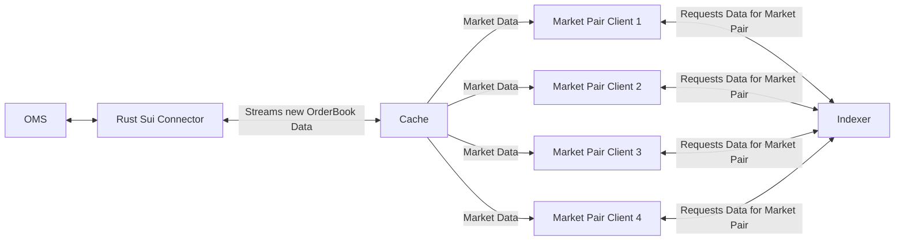

# Rust SUI connector

Located at `../rust_sui_connector`

## Requirements

1. Poll market data from the Deepbookv3 HTTP API
2. This market data must be polled at 1 seconds
3. The data to be polled must be validated
4. Errors relating to scenarios
5. Configuration arguments such as API url must be passed in via config to enable testing locally and through CICD.

## Decisions

### Use of a config file over alternatives

In line with 12-factor app principles (https://12factor.net/config), configuration should be separate from code and easily manageable. While environment variables are commonly used, a config file provides better maintainability for our specific use case.

#### Alternatives Considered

##### Hardcoded Values

Hard to update without modifying and redeploying the code.
Not scalable or flexible.
Violates 12-factor principles of keeping configuration separate from code.
Security Implications.

##### Environment Variables

Best suited for secrets & environment-specific settings (e.g., API keys, credentials).
Not ideal for structured configuration (e.g., JSON/YAML with nested values).
Harder to track changes and version in source control.
No easy rollback mechanism if a config change introduces an issue.

##### Why We Chose a Config File

No live updates needed - A static config file is sufficient.
Better versioning & tracking - Stored in version control, changes are visible.
No sensitive information - Can be safely committed without security risks.
Structured & readable - Supports JSON/YAML/TOML for easy organisation.
Consistent across environments - Can be used to create various simulated environments.

By using a config file, we ensure maintainability, transparency, and version control while keeping the application configuration flexible and manageable.

### Error Scenario Splitting

Choose to split application and product decision errors into different files.

e.g. Data Fetching, Config Loading - two different product domains where decisions are made and errors can be separated respectively.

### Data Pulling Rates 

It is a requirement that the data needs to be gathered at a rate of 1 block, which is roughly once a second. In order to test the loading capabilities of the endpoint, the following load tests were completed using postman to test the robustness of using this endpoint with several clients request at once.

## Architecture Diagrams

### V1

Initially to just prove we can access and convert the orderbook data from the SUI DeepBook Indexer, a simple rust connector was created where the following

### V2

However there are three reasons why this architecture is not scalable and maintainable:

1. API performance constraints - please see the load testing section for results. The use of a cache here would reduce load on the API by streaming data and providing an interface for the application that could be use synchronously rather than waiting for request to complete.
2. Polling rate and multiple clients/ market pairs - Lets hypothetically say that we perform the orderbook processing and requests for multiple Market pairs to the same API endpoint. As the number of request increases, so does the strain on the endpoint (not including other traffic that may be hitting the endpoint); thus increasing the chance of a request failure and a server error, which could result in data loss and therefore inaccurate order book calculations.
3. Similarity to other systems - there is currently a similar architecture deployed for the Solana OMS Integration, which has been validated to work correctly with the required performance. Furthermore, this makes the code reusable and therefore more maintainable.

